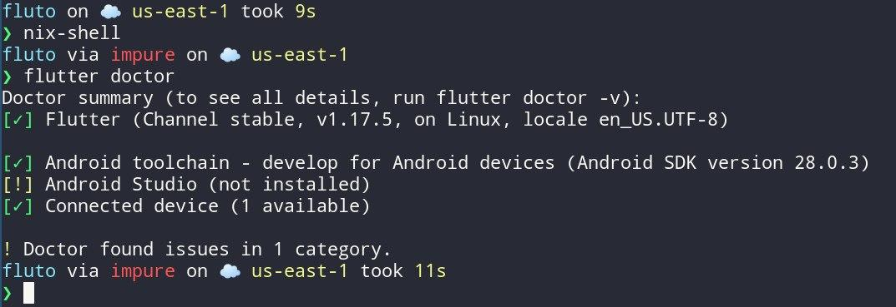

# Meu env de desenvolvimento android

### Flutter + Nix

| Nome | Versão |
| - | - |
| Flutter | 1.22.4 |
| Dart | 2.12.0-259.8.beta (null-safety) |
| Android SDK Tools | 28.0.3 |
| Android SDK Platform | 29 |

(testado somente no Debian 10 :orange_heart:)

Precisa de Nix instalado.

#### 1. Intalando o env

```sh
$  nix-shell
```

vai baixar tudo (flutter, android-sdk), então deve demorar.

#### 2. Fazendo `flutter doctor`

Deve dar o erro:

```
** Message: 23:48:32.926: Requires Linux version >= 3.19 built with CONFIG_USER_NS
** Message: 23:48:32.940: Run: sudo sysctl -w kernel.unprivileged_userns_clone=1
```

Resolva com:

```
$ sudo sysctl -w kernel.unprivileged_userns_clone=1
```

#### 3. Reconhecendo um dispositivo android conectado

1. Ative o modo desenvolvedor
2. Ative o modo debug
3. Conecte com o modo "Transferir Arquivo" ou algo parecido
4. Execute `sudo usermod -aG plugdev $LOGNAME`
5. Faça logout, ou abra outro terminal.

Pronto!

```sh
$  nix-shell
$  flutter doctor
```

vai usar tudo da cache, então deve ser rapido.


